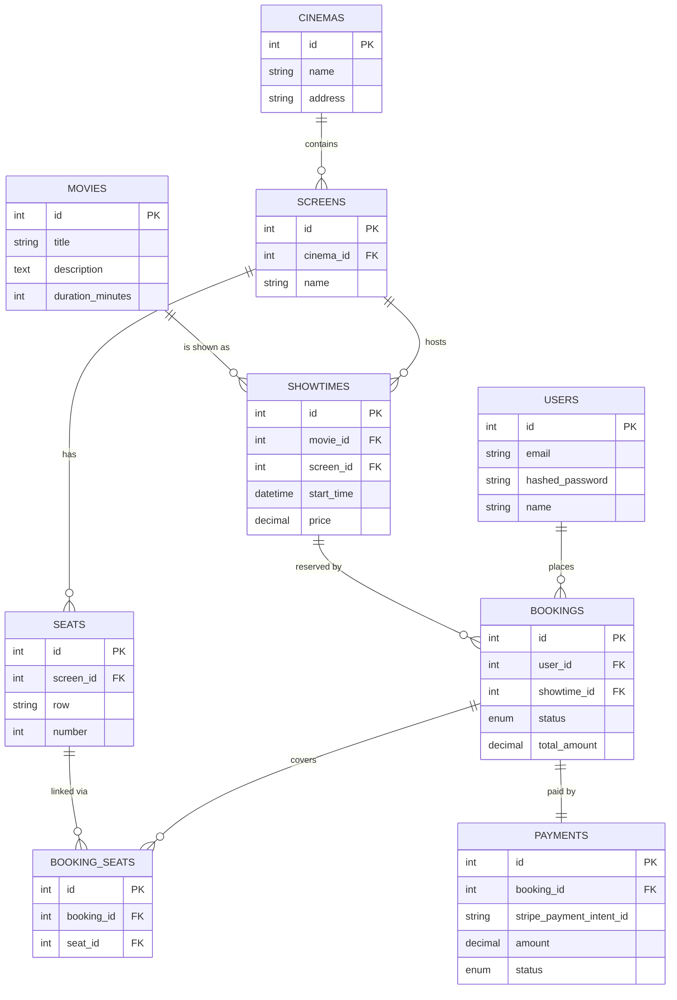

# Movie Booking — Project Notes

A walkthrough of what's been built so far, why each piece exists, and how the parts fit together. Read this when you need to refresh your memory or explain the project to someone else.

---

## The big picture (in two sentences)

We're building a movie ticket booking backend that demonstrates real-time concurrency control — specifically, preventing two users from booking the same seat at the same time. The interesting technical story is in the stack (async Python, Postgres row locking, Redis, eventually WebSockets), not in the booking app itself.

---

## Live URLs

- **API Backend:** https://movie-booking-backend-8r8x.onrender.com
- **Health check:** https://movie-booking-backend-8r8x.onrender.com/api/health
- **DB health check:** https://movie-booking-backend-8r8x.onrender.com/api/health/db
- **Auto-generated API docs (Swagger UI):** https://movie-booking-backend-8r8x.onrender.com/docs
- **Source code:** https://github.com/seshasaipothana/movie-booking

> Render's free tier sleeps after 15 minutes of inactivity. The first request after a sleep takes ~30 seconds to wake up.

---

## What's done so far

A working FastAPI backend that:
- Loads configuration from environment variables (locally from `.env`, in production from Render's env vars).
- Connects to a real cloud Postgres database (Neon, Singapore region for Asia-Pacific latency).
- Exposes two health-check endpoints.
- Has a complete relational schema modeled in code (9 tables) and applied to the live database via Alembic migrations.
- **Is deployed to Render with auto-deploy on push to `main`.**
- **Has a public URL that anyone can hit.**
- Has auto-generated OpenAPI/Swagger documentation at `/docs`.

What's NOT done yet: seed data, authentication, business logic (booking flow, seat locking), real-time updates, payments, frontend.

---

## The stack and why each piece

### Python 3.12 + `uv`
- **Python 3.12** because it's current stable, fast, and has improved error messages. Not 3.13 — a few libraries still lag on the latest minor version.
- **`uv`** as the package manager (replaces `pip` + `poetry`). It's written in Rust, dramatically faster than pip, and is the direction the Python ecosystem is moving in 2025-2026. We added dependencies with `uv add fastapi 'uvicorn[standard]'` etc., and they live in `pyproject.toml` with exact versions locked in `uv.lock`.

### FastAPI
- Modern Python web framework. Async-first, automatic request/response validation via Pydantic, free auto-generated OpenAPI docs at `/docs`.
- We chose it over Django because the project is API-only (no server-rendered templates) and we want the cleaner async story for WebSockets later.

### SQLAlchemy 2.0 (async) + asyncpg
- **SQLAlchemy 2.0** is the modern API — uses Python type hints (`Mapped[int]`, `Mapped[str]`) for column definitions. Cleaner than the older `Column(...)` style.
- **Async** means our database calls don't block the server while waiting for Postgres. Important for handling many requests concurrently.
- **asyncpg** is the actual async Postgres driver SQLAlchemy talks through. Faster than psycopg2 for our workload.

### Alembic
- Schema migration tool. We define our database schema in Python (the models), and Alembic figures out what SQL is needed to get the live database to match.
- Each schema change becomes a versioned migration file in `alembic/versions/`. Like Git for the database.
- On every Render deploy, Alembic runs as part of the build command — meaning schema changes propagate to production automatically.

### Neon Postgres
- Serverless cloud Postgres. Generous free tier.
- We use Singapore region (`ap-southeast-1`) — closer to us in India for development. Production traffic from Render (Oregon) hops across the Pacific, which is fine for our current scale.
- We use a connection pooler endpoint (`-pooler` in the hostname) which is the right choice for asyncpg.

### Pydantic Settings
- Loads settings from environment variables and `.env` files. Validates types at startup — if `DATABASE_URL` is missing, the app refuses to start with a clear error rather than crashing later.
- Follows twelve-factor app principles: config lives in the environment, not in code. Same code, different values in dev vs production.

### `ruff`
- Linter and formatter in one tool. Replaces Black, isort, and flake8. Configured in `pyproject.toml`.

### Render
- Cloud platform hosting our backend.
- Free tier (web service sleeps after 15 minutes of inactivity, takes ~30 seconds to wake up).
- Auto-deploys on every push to `main`.
- Build command runs `pip install uv && uv sync --frozen && uv run alembic upgrade head` — which installs deps and applies migrations before starting the server.
- Start command runs `uv run uvicorn app.main:app --host 0.0.0.0 --port $PORT` — `0.0.0.0` so it's reachable from outside the container, `$PORT` because Render assigns the port.

---

## Project structure

```
movie-booking/
├── DECISIONS.md              ← architectural decisions, in chronological order
├── README.md                 ← project overview with live URLs
├── docs/
│   └── PROJECT_NOTES.md      ← this file
├── .gitignore                ← keeps .env, .venv/, __pycache__/, etc. out of Git
└── backend/
    ├── .env                  ← DATABASE_URL etc. NEVER committed.
    ├── pyproject.toml        ← project metadata, dependencies, ruff config
    ├── uv.lock               ← exact dependency versions (committed)
    ├── alembic.ini           ← Alembic config
    ├── alembic/
    │   ├── env.py            ← Alembic startup script — wired to our settings & models
    │   └── versions/
    │       └── e41d85f26ab5_create_initial_schema.py  ← the first migration
    └── app/
        ├── main.py           ← FastAPI entry point — creates app, mounts routers
        ├── core/
        │   └── config.py     ← Pydantic Settings — loads from .env
        ├── api/
        │   └── health.py     ← /api/health and /api/health/db endpoints
        ├── db/
        │   └── base.py       ← SQLAlchemy declarative Base
        └── models/
            ├── __init__.py   ← imports all models so they register with Base.metadata
            ├── user.py
            ├── cinema.py
            ├── movie.py
            ├── screen.py
            ├── seat.py
            ├── showtime.py
            ├── booking.py
            ├── booking_seat.py
            └── payment.py
```

---

## The flow: what happens when you start the server and hit an endpoint

### Locally (development)

1. You run `uv run uvicorn app.main:app --reload --port 8000`.
2. `uv run` uses the project's virtualenv. `uvicorn` is the ASGI web server. It loads `app/main.py` and finds the variable `app` (the FastAPI instance).
3. Importing `main.py` triggers imports of `config.py` and `health.py`. `config.py` runs `settings = Settings()` immediately, which reads `.env` and validates. If anything's wrong, the server fails to start with a clear error.
4. The FastAPI app instance is constructed with health endpoints attached.
5. uvicorn listens on port 8000.
6. A request comes in, e.g. `GET /api/health/db`. uvicorn routes it to the matching handler in `health.py`.
7. The handler creates an async engine using `settings.database_url`, opens a connection to Neon, runs `SELECT 1`, returns `{"db": "ok"}`.

### In production (Render)

Same flow, with these differences:
- The server runs on Render's container, not your laptop.
- `--host 0.0.0.0` so the container's port is exposed externally.
- Port number comes from `$PORT` (assigned by Render).
- Settings come from Render's env vars (set via dashboard), not a `.env` file.
- The whole thing is reachable at `https://movie-booking-backend-8r8x.onrender.com`.

### The deploy flow

1. You push to GitHub on `main`.
2. Render notices the push and starts a build.
3. Render checks out the repo.
4. Runs the build command: `pip install uv && uv sync --frozen && uv run alembic upgrade head`.
5. If everything succeeds, runs the start command: `uv run uvicorn app.main:app --host 0.0.0.0 --port $PORT`.
6. The new version goes live.

If any step fails, the old version stays up — Render only switches over after a successful build.

---

## The schema — 9 tables, why each one, and how they connect

Read this section thinking "row in this table = one of what?"

### `users`
- A person who can log in and book tickets.
- Columns: `id`, `email` (unique, indexed), `hashed_password`, `name`, `created_at`.
- Notes: passwords are never stored in plain text — we'll hash them with bcrypt later. Email is indexed because login flows query by email constantly.

### `cinemas`
- A physical movie theater location.
- Columns: `id`, `name` (indexed), `address`.

### `movies`
- A film that can be shown.
- Columns: `id`, `title` (indexed), `description` (long text), `duration_minutes`, `poster_url` (nullable).
- Notes: `description` uses `Text` instead of `String(N)` because it can be paragraph-length. `poster_url` is nullable because some movies might not have a poster while seeding test data.

### `screens`
- A specific auditorium inside a cinema.
- Columns: `id`, `cinema_id` (FK → cinemas, indexed, ON DELETE CASCADE), `name` (e.g. "Screen 1", "IMAX").
- Why CASCADE: if a cinema is deleted, its screens are meaningless and should go too.

### `seats`
- An individual seat in a specific screen.
- Columns: `id`, `screen_id` (FK → screens, indexed, ON DELETE CASCADE), `row` (e.g. "A"), `number` (e.g. 5).
- Composite unique constraint on `(screen_id, row, number)` — there can only be one seat A1 in screen 5. Two seat A1s in screen 5 would create chaos for booking.
- Why seats are rows and not a JSON array: foreign keys can't point into JSON; row-level locking (SELECT FOR UPDATE) requires real rows; indexing/querying needs real columns; DB-enforced integrity needs real foreign-key targets.

### `showtimes`
- A scheduled screening of a movie on a screen at a specific time.
- Columns: `id`, `movie_id` (FK), `screen_id` (FK), `start_time` (timezone-aware, indexed), `price` (Decimal).
- Why `Numeric(8,2)` for price: never use `float` for money — binary floats can't represent decimal fractions exactly, leading to accumulated rounding errors. `Numeric` (a.k.a. `DECIMAL`) is exact.
- `start_time` is indexed because "show me upcoming showtimes" is the most common user query.

### `bookings`
- A user's reservation of seats for a specific showtime.
- Columns: `id`, `user_id` (FK, RESTRICT), `showtime_id` (FK, RESTRICT), `status` (enum: pending/confirmed/cancelled, default pending, indexed), `total_amount` (Decimal), `created_at`.
- Why RESTRICT (not CASCADE): bookings are financial records. Postgres should refuse to delete a user with active bookings, forcing the application to make a conscious decision (anonymize the user, archive the bookings, etc.).
- Status enum: Postgres creates a real enum type (`booking_status`) so any value other than the three valid ones is rejected at the database level.

### `booking_seats` (junction table)
- One row per (booking, seat) pair. Links bookings to the specific seats they include.
- Columns: `id`, `booking_id` (FK, CASCADE), `seat_id` (FK, RESTRICT), with a unique constraint on `(booking_id, seat_id)`.
- Why this table exists: a booking can include multiple seats (one to many). Without a separate table, we'd need a JSON array on `bookings`, which loses foreign keys, locking, indexing, and integrity. Junction tables are the standard SQL pattern for many-to-many relationships.
- Why CASCADE for `booking_id` and RESTRICT for `seat_id`: deleting a booking means its link rows are meaningless (cascade them away). Deleting a seat that's still referenced would corrupt history (block it).

### `payments`
- The financial record for a booking.
- Columns: `id`, `booking_id` (FK, RESTRICT, **unique** — one booking has exactly one payment), `stripe_payment_intent_id` (nullable, unique), `amount` (Decimal), `status` (enum: pending/succeeded/failed/refunded), `created_at`.
- Why a separate table from `bookings`: payments have their own lifecycle and external identifiers (Stripe intent ID). Mixing them into the booking row would confuse the two concerns.
- The 1-to-1 relationship is enforced by `unique=True` on `booking_id`.

---

## How the tables connect (the relationship map)



> The diagram above is written in Mermaid syntax. GitHub renders it automatically as a visual diagram when you view this file on github.com. If you're reading the raw markdown source, you'll see the code instead.

Plain English:
- A cinema has many screens. A screen has many seats. (`cinema_id` lives on `screens`; `screen_id` lives on `seats`.)
- A movie has many showtimes. A screen has many showtimes. A showtime is the intersection — "this movie on this screen at this time."
- A user has many bookings. A showtime has many bookings. A booking is the intersection — "this user booked this showtime."
- A booking includes many seats, via the `booking_seats` junction table.
- Each booking has exactly one payment.

---

## Foreign key rule (one-line version)

The FK column always lives on the "many" side of a one-to-many relationship. Example: many screens belong to one cinema → `cinema_id` lives on `screens`. Putting it the other way would force the parent table to duplicate rows for each child, which breaks "one row per entity."

---

## ON DELETE rules — quick reference

- **CASCADE** — when the parent is deleted, delete the child too. Used when the child is meaningless without the parent (e.g. `screens` of a deleted cinema).
- **RESTRICT** — refuse to delete the parent while children reference it. Used when child rows have independent significance (e.g. financial records: `bookings`, `payments`).

---

## Key decisions and the reasoning

This is the section to read before an interview.

| Decision | Why |
|---|---|
| Async all the way (FastAPI + asyncpg) | Cleaner story for WebSockets later; non-blocking DB calls handle concurrent users better |
| `Numeric` not `float` for money | Floats lose precision on decimals; never used for currency in real systems |
| Seats as rows, not JSON | FKs need rows; row-level locking needs rows; indexing needs columns |
| Junction table for booking↔seats | Standard SQL pattern for many-to-many; preserves integrity and locking |
| Postgres enums for status | Database-level rejection of invalid values |
| `unique=True` on `payments.booking_id` | Enforces 1-to-1 (one payment per booking) at the DB |
| Pydantic Settings + `.env` | Twelve-factor config; fail-fast at startup if misconfigured |
| `uv` over `pip`/`poetry` | Faster, modern, where the ecosystem is heading |
| Alembic over raw SQL migrations | Versioned, reversible, generated from models — matches industry practice |
| Migrations in build command | Schema changes ship with code, automatically, every deploy |
| 1-2 cinemas, 3 screens scope | Realistic-looking without exploding scope |
| Decisions log committed to repo | Interview prep document by the time the project is done |
| Render free tier with deploy-on-push | Real CI/CD pipeline from day 1; same workflow as a professional team |

---

## What you can defend in an interview right now

If asked tomorrow to walk through what you've built so far, here's the shape of a strong answer:

> "I've built and deployed a movie ticket booking backend in FastAPI with async SQLAlchemy and asyncpg, talking to Postgres on Neon. It's live at movie-booking-backend-8r8x.onrender.com. The schema is nine tables modeling users, cinemas, screens, seats, movies, showtimes, bookings, booking-seats junction, and payments. I used Alembic for migrations, Pydantic Settings for config, and `uv` for dependency management. CI/CD is set up so every push to main auto-deploys to Render with migrations applied as part of the build.
>
> The most interesting design decisions: I put `Numeric` columns for money instead of float to avoid rounding errors, used a junction table for the booking-to-seats many-to-many relationship so I could enforce integrity and use row-level locking later, and used Postgres enum types for status fields so invalid values are rejected at the database level.
>
> The next piece I'm building is the seat-booking endpoint with `SELECT FOR UPDATE` row locks to prevent two users from booking the same seat simultaneously."

That's the elevator pitch. You can deliver it because every claim in it is something we actually built or will build, and you can answer follow-up questions on each part.

---

## What's next

In rough order:
1. **Seed script** — populate sample movies, cinemas, screens, seats, showtimes
2. **JWT auth** — signup, login endpoints
3. **Browse endpoints** — list cinemas, movies, showtimes
4. **Seat-locking booking endpoint** — the headline feature, using `SELECT FOR UPDATE`
5. **WebSockets** for live seat updates
6. **Stripe test-mode payments**
7. **React + TypeScript frontend**

---

## Glossary (terms you encountered)

- **ORM** — Object-Relational Mapper. Translates between Python objects and database rows.
- **Migration** — a versioned schema change (CREATE TABLE, ADD COLUMN, etc.) checked into the repo.
- **Foreign key (FK)** — a column on one table that points to a row in another table.
- **Junction table** — a table whose only job is to link two other tables in a many-to-many relationship.
- **Async / event loop** — Python's mechanism for non-blocking I/O. Async functions can pause while waiting for I/O (DB queries, HTTP calls) without blocking other work.
- **ASGI** — Asynchronous Server Gateway Interface. The protocol uvicorn uses to talk to FastAPI.
- **Twelve-factor app** — a set of principles (Heroku-originated) for building deployable apps. We're following several: config in environment, dev/prod parity, declarative dependencies.
- **Composite unique constraint** — uniqueness across multiple columns combined, e.g. (screen_id, row, number) must be unique together.
- **Connection pooler** — a layer between your app and Postgres that reuses connections. Neon offers one at the `-pooler` hostname.
- **CI/CD** — Continuous Integration / Continuous Deployment. The pipeline that automatically builds, tests, and deploys code on every push.
- **Cold start** — when a sleeping server has to spin up to handle the first request after inactivity. Render free tier cold starts take ~30 seconds.

---

*Last updated: 2026-04-30, after first Render deploy.*
